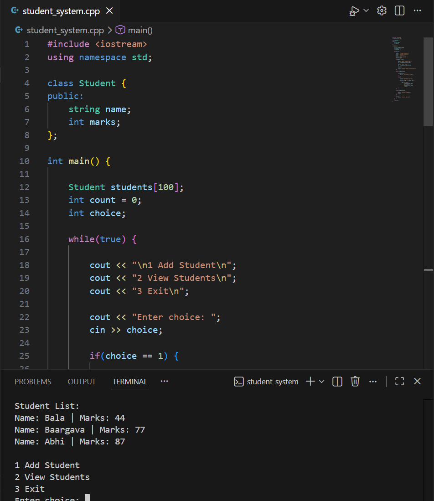

# Student Management System (C++)

A simple console-based Student Management System built using C++.
This program allows users to add student records and view stored student information using a menu-driven interface.

## Features

* Add student name and marks
* Store multiple student records
* View all stored students
* Menu-driven console program

## Technologies Used

* C++
* Classes and Objects
* Arrays
* Loops and Conditional Statements
* Standard Input/Output (`cin`, `cout`)

## Project Structure

student_system.cpp
README.md

## How to Run

Compile the program:

g++ student_system.cpp -o student_system

Run the program:

.\student_system

## Example Output

1 Add Student
2 View Students
3 Exit

Enter choice: 1

Enter student name: Surya
Enter marks: 85

Student added successfully!

## Concepts Demonstrated

* Classes and Objects in C++
* Arrays
* Loops
* Menu-based programs
* Basic data management

## Author

Surya

